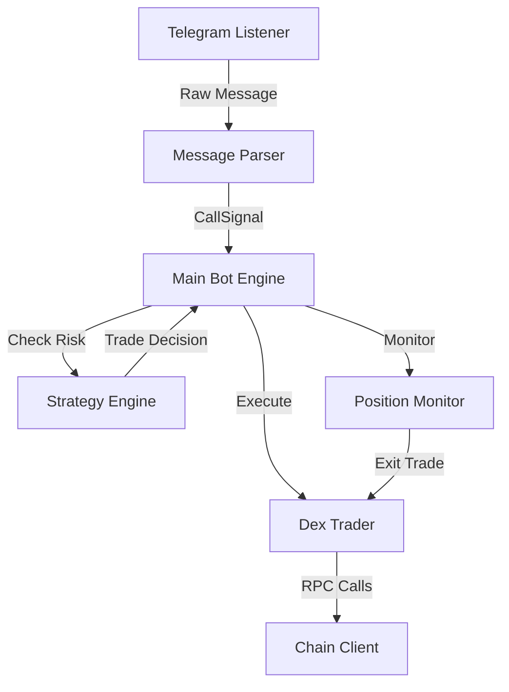

# Robinhood Chain Copy-Trader Bot

An automated trading bot designed for the Robinhood Chain (Chain ID: 4663). It monitors a specific Telegram channel for token calls, parses the signals, and automatically executes trades using a disciplined 2-step compounding strategy to maximize upside while strictly controlling downside risk.

## 🏗️ Architecture



## 📋 Prerequisites

- Python 3.9+
- Telegram Account (API ID & Hash)
- MetaMask or compatible wallet (Private Key)
- ETH on Robinhood Chain for trading and gas fees

## ⚙️ Setup Instructions

1. **Clone the repository:**
   ```bash
   git clone <repo-url>
   cd robinhood_copy_trader
   ```

2. **Install dependencies:**
   ```bash
   pip install -r requirements.txt
   ```

3. **Get Telegram Credentials:**
   Go to [my.telegram.org](https://my.telegram.org) and generate an API ID and API Hash.

4. **Configure Environment:**
   Copy the example environment file and fill in your details:
   ```bash
   cp .env.example .env
   ```
   *Edit `.env` and add your `PRIVATE_KEY`, `TELEGRAM_API_ID`, `TELEGRAM_API_HASH`, etc.*

5. **Bridge ETH:**
   Ensure you have ETH on the Robinhood Chain.

6. **Run Dry Run Test:**
   ```bash
   python test_dry_run.py
   ```
   *This simulates trades and verifies strategy logic without real money.*

7. **Run Paper Trading Mode:**
   Ensure `DRY_RUN=True` in your `.env` and run:
   ```bash
   python main.py
   ```

8. **Go Live:**
   After you are comfortable with the bot's behavior, set `DRY_RUN=False` in `.env` and run the bot.

## 📈 Strategy Overview

The bot employs a **2-step compounding strategy**:
- **Baseline State**: Risks $2 to make $3 (1.5x RR).
- **Compound State**: If baseline wins, it risks the entire $5 ($2 initial + $3 profit) to make $7.50.
- **Reset**: A win or loss in the compound state resets the strategy to baseline. Any loss in baseline keeps the strategy in baseline.
- **Circuit Breaker**: If total capital drops from the initial $50 to below $40, trading is HALTED to prevent further losses.

## 🔧 Configuration Reference

Variables in `.env`:
- `DRY_RUN`: `True` to simulate trades, `False` to execute real trades.
- `RPC_URL`: Endpoint for Robinhood Chain RPC.
- `PRIVATE_KEY`: Your wallet's private key.
- `TELEGRAM_API_ID` / `TELEGRAM_API_HASH`: Telegram API credentials.
- `CHANNEL_USERNAME`: The username of the Telegram channel to scrape calls from.

## ⚠️ WARNING & DISCLAIMERS

> [!CAUTION]
> **FINANCIAL RISK**: Trading volatile crypto assets involves significant risk. This bot is provided AS-IS. You can lose all your invested capital. Do not use funds you cannot afford to lose.
> 
> The developers of this software are not responsible for any financial losses incurred through its use. Use at your own risk.
